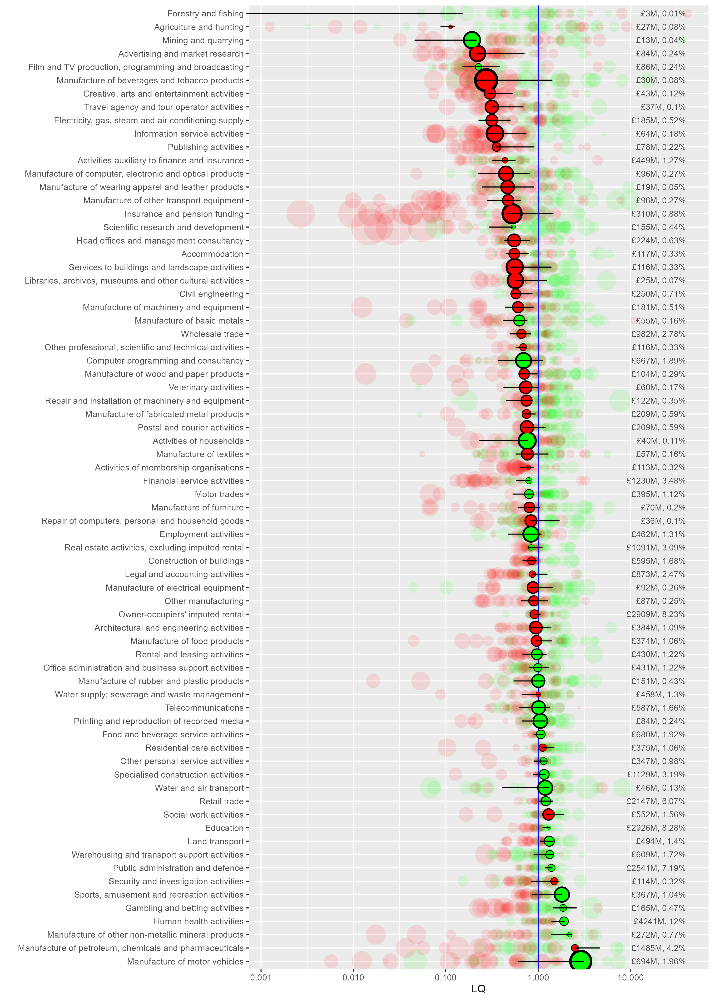

```{r setup, include=FALSE}
knitr::opts_chunk$set(echo = TRUE, warning = F, error = F, message = F, comment=NA)
```

# Analysing the ONS 'GVA by industry by ITL region' data in R

The ONS produces an [Excel document](https://www.ons.gov.uk/economy/grossvalueaddedgva/datasets/nominalandrealregionalgrossvalueaddedbalancedbyindustry) with GVA data at three different geographical scales, ITL1 to ITL3. Wikipedia has an [excellent explanation with maps](https://en.wikipedia.org/wiki/International_Territorial_Level) of the ITL regions.

IT2 level data includes several zones that match existing mayoral authorities. ITL3 data has zones matching **local** authorities - but neither perfectly. Some are grouped. For example, ITL3 zones in South Yorkshire separate Sheffield from the other three local authorities in South Yorkshire grouped into one zone (Rotherham, Barnsley, Doncaster).

Here, we'll explore some ways to analyse this data using R. The data has been processed to make it more useable in R - see the [process_from_excel.R](process_from_excel.R) script and its comments for an explanation of how to get from the Excel sheet to the datasets used here. All of the derived files (and the original ONS excel sheet downloaded from the above page, current version dated 25th April 2023) are included in this repository in the [data folder](data). 

We'll look at the **current prices** data, not the chained volume data. We'll be making **location quotients**, which require being able to sum different regions in different ways; chained volume measures can't be summed. Current price data (prices at the time point of the data) can't be used to measure nominal growth as it's not inflation adjusted, but as long as we're working with proportional change over time (which as we'll see, LQs are), they're fine.


## Loading in data and finding location quotients

First, load the libraries we'll be using, and get the ITL2 level data. (If you haven't already, install the libraries/packages with e.g. `install.packages("tidyverse")` before loading here.) Also, load some functions that include an LQ function.

```{r loadITL2}
library(tidyverse)
library(sf)
library(tmap)
source('functions/misc_functions.R')
options(scipen = 99)#Avoids scientific notation

itl2.cp <- read_csv('data/ITL2currentprices_long.csv')

```

In this dataframe, we have: ITL2 regions, SIC sectors and year - ranging from `r min(itl2.cp$year)` to `r max(itl2.cp$year)` in the current data - and finally the current price GVA value.

Then we'll find the **location quotients** for the whole dataset. The [Excel sheet here](https://www.ons.gov.uk/employmentandlabourmarket/peopleinwork/employmentandemployeetypes/datasets/locationquotientdataandindustrialspecialisationforlocalauthorities) from the ONS has an excellent explanation of location quotients in its notes, I won't repeat all of that here. But a quick word on what the location quotient is showing for this data:

* The location quotient gives a **measure of concentration** for sectors (both within regions and across them, see below) when compared to a larger geography (the UK in this case).
* The LQ is found easily: it's the ratio of two ratios - the proportion of a sector in region x, over the proportion of that sector in the UK as a whole.
* If the LQ > 1, that industry is *relatively more concentrated* in the region, compared to the UK.
* If the LQ < 1, that industry is *relatively less concentrated* in the region, compared to the UK.
* We're looking at raw GVA values here - the total GVA value of a particular sector in a region tells us something about that region's economic structure. But it can't directly be used to say anything definitive about productivity, since we don't know e.g. if that GVA value is due to high productivity workers, or just a very large but lower productivity sector.
* LQs are good for getting a structural overview, but their biggest weakness is that a regional sector can be *proportionally larger* than the UK, but itself quite small. So a region's top LQ sector may still be a tiny part of its overall economy. We'll look at a way to overcome that weakness below.
* As the [ONS Excel sheet on LQs](https://www.ons.gov.uk/employmentandlabourmarket/peopleinwork/employmentandemployeetypes/datasets/locationquotientdataandindustrialspecialisationforlocalauthorities) make really clear, because (A/B)/(C/D) is equivalent to (A/C)/(B/D), the LQ actually captures two related ways of seeing the same thing: how relatively concentrated sectors are *across a whole geography* like the UK, and how concentrated *within a subgeography* like South Yorkshire they are. (See the table in the ONS document - numbers which can be read either across geographies or across sectors.)

The LQ function takes in a dataframe, the name of the region column, the name of the sector column and the name of the value column to find the LQ for. It returns the same dataframe with the LQ and region and total proportions added (we'll need those proportions later), as well the LQ logged, which will help with plotting (as the log makes plus/minus 1 values symmetric).

First, here's the function working on a single year in the data, to illustrate what the function takes in.

```{r lqoneyear}
lq1998 <- add_location_quotient_and_proportions(
  df = itl2.cp %>% filter(year == 1998),
  regionvar = ITL_region_name,
  lq_var = SIC07_description,
  valuevar = value
)

```

Let's repeat that for all years and replace the original dataframe with the result.

```{r lqall}
itl2.cp <- itl2.cp %>% 
  split(.$year) %>% 
  map(add_location_quotient_and_proportions, 
      regionvar = ITL_region_name,
      lq_var = SIC07_description,
      valuevar = value) %>% 
  bind_rows()

```

Taking a quick look at the resulting LQs, this is **top ten LQ sectors for South Yorkshire**, showing which sectors have relatively larger proportions of GVA in South Yorkshire compared to the UK as a whole.

Note we can see the point made above about *relative* LQ concentration not capturing actual scale. 'Manufacture of basic metals' has 5 times the GVA concentration of the UK as a whole, but its regional percent of GVA is only 1.28%. This is reflecting that this sector is generally small everywhere, just larger in South Yorkshire. Contrast with 'Education' - still a higher relative proportion than the UK with an LQ of 1.7, but it's actually nearly 11% of South Yorkshire's GVA.


```{r quickLQlook_SY}
itl2.cp %>% filter(
  ITL_region_name == 'South Yorkshire',
  year == 2021
  ) %>% 
  mutate(regional_percent = sector_regional_proportion *100) %>% 
  select(SIC07_description,regional_percent, LQ) %>% 
  arrange(-LQ) %>% 
  slice(1:10)

```

Repeating that for Greater Manchester, where none of the LQ top ten are especially large percentages of its GVA:

```{r quickLQlook_GM}
itl2.cp %>% filter(
  ITL_region_name == 'Greater Manchester',
  year == 2021
  ) %>% 
  mutate(regional_percent = sector_regional_proportion *100) %>% 
  select(SIC07_description,regional_percent, LQ) %>% 
  arrange(-LQ) %>% 
  slice(1:10)

```


Liverpool City Region has three public-sector-heavy SICs in its LQ top ten:

```{r quickLQlook_LCR}
itl2.cp %>% filter(
  ITL_region_name == 'Merseyside',
  year == 2021
  ) %>% 
  mutate(regional_percent = sector_regional_proportion *100) %>% 
  select(SIC07_description,regional_percent, LQ) %>% 
  arrange(-LQ) %>% 
  slice(1:10)

```


As mentioned, the LQ has a handy bonus feature: it can be used either to compare sectors *within* subregions, as above, or - looking at individual sectors - to see how geographical concentration differs.

Sectors with the highest difference across places in the uK will have a higher spread between their min and max LQ values. Some sectors - often public sectors - are fairly evenly spread everywhere. Here we find the spread and pick out the top five most geographically varied:

```{r geogconc}
#Find the geographical variation of sectors using the LQ spread
LQspread <- itl2.cp %>% 
  filter(year == 2021) %>% 
  group_by(SIC07_description) %>% 
  summarise(LQ_spread = diff(range(LQ))) %>% 
  arrange(-LQ_spread)

#Show top 5
LQspread[1:5,]
```

That can then be used to pick out particular sectors to map. For example, South Yorshire's most concentrated GVA sector - manufacture of basic metals - looks like this across the UK (note South Yorkshire doesn't top the most concentrated for this sector).

The map shapefiles are included in this repo, and can also be downloaded from [geoportal.statistics.gov.uk](https://geoportal.statistics.gov.uk/).

```{r geogconc_map}
#Load ITL2 map data using the sf library
itl2.geo <- st_read('data/ITL_geographies/International_Territorial_Level_2_January_2021_UK_BFE_V2_2022_-4735199360818908762/ITL2_JAN_2021_UK_BFE_V2.shp', quiet = T) %>% 
  st_simplify(preserveTopology = T, dTolerance = 100)

#Join map data to a subset of the GVA data
sector_LQ_map <- itl2.geo %>% 
  right_join(
    itl2.cp %>% filter(
      year==2021,
      SIC07_description == LQspread$SIC07_description[4]#picking out the fourth highest geographical spread sector
      ),
    by = c('ITL221NM'='ITL_region_name')
  )


#Plot map
tm_shape(sector_LQ_map) +
  tm_polygons('LQ_log', n = 9) +
  tm_layout(title = 'LQ spread of\nBasic metals\nAcross ITL2 regions', legend.outside = T)

```


## LQ change and growth over time 

Now onto plotting LQs themselves. To do this, we'll add in a measure of what the change/growth trends for LQs are, for each sector in each ITL2 zone. This next function adds in some ordinary least squares slopes for LQ change over time, to get a sense of the growth trends. LQ_log is used so that slope scale is the same for different size sectors, so their trends are comparable. (It returns zero for any region/sector combinations with no data at all.)


```{r slopes}
#Use
#LQ_slopes %>% filter(slope==0)
#To see which didn't get slopes (only 8 rows in the current data)
LQ_slopes <- compute_slope_or_zero(
  data = itl2.cp, 
  ITL_region_name, SIC07_description, 
  y = LQ_log, x = year)

```

We'll plot data for a single year, but include that information about how LQ has changed over the full range of the data from `r min(itl2.cp$year)` to `r max(itl2.cp$year)`. 

The following code does three things:

1. Filters down to a single year and keeps in *yeartoplot*.
2. Joins the LQ slopes to this single year, so we can see what the trends were in the rest of the time range for each place and sector
3. Finds the minimum and maximum LQ values for the entire data range, for each place and year (this is explained more below when looking at a plot) and adds this to *yeartoplot*.


```{r LQ_plot_prep1}
#Filter down to a single year
yeartoplot <- itl2.cp %>% filter(year == 2021)

#Add slopes into data to get LQ plots
yeartoplot <- yeartoplot %>% 
  left_join(
    LQ_slopes,
    by = c('ITL_region_name','SIC07_description')
  )

#Get min/max values for LQ over time as well, for each sector and place, to add as bars so range of sector is easy to see
minmaxes <- itl2.cp %>% 
  group_by(SIC07_description,ITL_region_name) %>% 
  summarise(
    min_LQ_all_time = min(LQ),
    max_LQ_all_time = max(LQ)
  )

#Join min and max
yeartoplot <- yeartoplot %>% 
  left_join(
    minmaxes,
    by = c('ITL_region_name','SIC07_description')
  )
```

We then pick a place to take an initial look at - **Liverpool City Region**. This will be the main place on the plot, with others to compare to. We also order the sectors by LCR's LQ, so they're ordered in the plots.


```{r }
place = 'Merseyside'

#Get a vector with sectors ordered by the place's LQs, descending order
sectorLQorder <- itl2.cp %>% filter(
  ITL_region_name == place,
  year == 2021
) %>% 
  arrange(-LQ) %>% 
  select(SIC07_description) %>% 
  pull()

#Turn the sector column into a factor and order by LCR's LQs
yeartoplot$SIC07_description <- factor(yeartoplot$SIC07_description, levels = sectorLQorder, ordered = T)
```

This first plot is unwieldy, but let's look at every sector before zooming in. The plot functions do two things:

1. The first function (*LQ_baseplot*) begins the plot by adding **all places** faintly. We also have the option of not including this by setting alpha to zero, but it still functions as the base plot initialisation, so always use.
2. The function *addplacename_to_LQplot* can be used repeatedly to add specific places with clearer shapes (choose shape numbers from somewhere [like here](http://www.sthda.com/english/wiki/ggplot2-point-shapes)).

Other examples below explain this more, but here's that plot to start with:

```{r LQ_plot1, eval=F}
p <- LQ_baseplot(df = yeartoplot, alpha = 0.1, sector_name = SIC07_description, LQ_column = LQ, change_over_time = slope)

p <- addplacename_to_LQplot(df = yeartoplot, placename = 'Merseyside',
                            plot_to_addto = p, shapenumber = 16, add_gva = T,
                        min_LQ_all_time = min_LQ_all_time,max_LQ_all_time = max_LQ_all_time,#don't need to include these
                        value_column = value, sector_regional_proportion = sector_regional_proportion,#don't need to include these
                        region_name = ITL_region_name,#The next four, the function needs them all 
                        sector_name = SIC07_description,
                        change_over_time = slope, 
                        LQ_column = LQ 
                        )

p
```

The version here is a saved copy with larger dimensions, so it's (just about) readable. Let's look at a subset in the plot after this one before explaining what's going on here.


```{r saveplot_dontshow, eval = F, echo = F}
#Code for saving here, won't run
ggsave(plot = p, filename = paste0('README_files/gva_',gsub(' ','',place),'_plot.png'), width = 10, height = 14)

```





```{r reduceLQ}
# Reduce to SY LQ 1+
lq.selection <- yeartoplot %>% filter(
  ITL_region_name == place,
  LQ > 1
  )

#Keep only sectors that were LQ > 1 frfom the main plotting df
yeartoplot <- yeartoplot %>% filter(
  SIC07_description %in% lq.selection$SIC07_description
)

```


