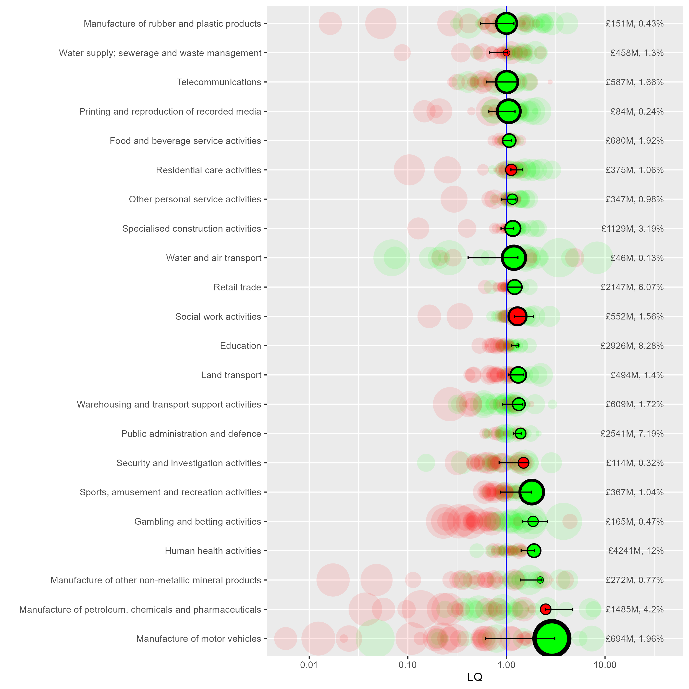

```{r setup, include=FALSE}
knitr::opts_chunk$set(echo = TRUE, warning = F, error = F, message = F, comment=NA)
```

# Analysing the ONS 'GVA by industry by ITL region' data in R

The ONS produces an [Excel document](https://www.ons.gov.uk/economy/grossvalueaddedgva/datasets/nominalandrealregionalgrossvalueaddedbalancedbyindustry) with GVA data at three different geographical scales, ITL1 to ITL3. Wikipedia has an [excellent explanation with maps](https://en.wikipedia.org/wiki/International_Territorial_Level) of the ITL regions.

IT2 level data includes several zones that match existing mayoral authorities. ITL3 data has zones matching **local** authorities - but neither perfectly. Some are grouped. For example, ITL3 zones in South Yorkshire separate Sheffield from the other three local authorities in South Yorkshire grouped into one zone (Rotherham, Barnsley, Doncaster).

Here, we'll explore some ways to analyse this data using R. The data has been processed to make it more useable in R - see the [process_from_excel.R](process_from_excel.R) script and its comments for an explanation of how to get from the Excel sheet to the datasets used here. All of the derived files (and the original ONS excel sheet downloaded from the above page, current version dated 25th April 2023) are included in this repository in the [data folder](data). 

We'll look at the **current prices** data, not the chained volume data. We'll be making **location quotients**, which require being able to sum different regions in different ways; chained volume measures can't be summed. Current price data (prices at the time point of the data) can't be used to measure nominal growth as it's not inflation adjusted, but as long as we're working with proportional change over time (which as we'll see, LQs are), they're fine.


## Loading in data and finding location quotients

First, load the libraries we'll be using, and get the ITL2 level data. (If you haven't already, install the libraries/packages with e.g. `install.packages("tidyverse")` before loading here.) Also, load some functions that include an LQ function.

```{r loadITL2}
library(tidyverse)
library(sf)
library(tmap)
library(plotly)
library(zoo)#For moving average function
source('functions/misc_functions.R')
options(scipen = 99)#Avoids scientific notation

itl2.cp <- read_csv('data/ITL2currentprices_long.csv')

```

In this dataframe, we have: ITL2 regions, SIC sectors and year - ranging from `r min(itl2.cp$year)` to `r max(itl2.cp$year)` in the current data - and finally the current price GVA value.

Then we'll find the **location quotients** for the whole dataset. The [Excel sheet here](https://www.ons.gov.uk/employmentandlabourmarket/peopleinwork/employmentandemployeetypes/datasets/locationquotientdataandindustrialspecialisationforlocalauthorities) from the ONS has an excellent explanation of location quotients in its notes, I won't repeat all of that here. But a quick word on what the location quotient is showing for this data:

* The location quotient gives a **measure of concentration** for sectors (both within regions and across them, see below) when compared to a larger geography (the UK in this case).
* The LQ is found easily: it's the ratio of two ratios - the proportion of a sector in region x, over the proportion of that sector in the UK as a whole.
* If the LQ > 1, that industry is *relatively more concentrated* in the region, compared to the UK.
* If the LQ < 1, that industry is *relatively less concentrated* in the region, compared to the UK.
* We're looking at raw GVA values here - the total GVA value of a particular sector in a region tells us something about that region's economic structure. But it can't directly be used to say anything definitive about productivity, since we don't know e.g. if that GVA value is due to high productivity workers, or just a very large but lower productivity sector.
* LQs are good for getting a structural overview, but their biggest weakness is that a regional sector can be *proportionally larger* than the UK, but itself quite small. So a region's top LQ sector may still be a tiny part of its overall economy. We'll look at a way to overcome that weakness below.
* As the [ONS Excel sheet on LQs](https://www.ons.gov.uk/employmentandlabourmarket/peopleinwork/employmentandemployeetypes/datasets/locationquotientdataandindustrialspecialisationforlocalauthorities) make really clear, because (A/B)/(C/D) is equivalent to (A/C)/(B/D), the LQ actually captures two related ways of seeing the same thing: how relatively concentrated sectors are *across a whole geography* like the UK, and how concentrated *within a subgeography* like South Yorkshire they are. (See the table in the ONS document - numbers which can be read either across geographies or across sectors.)

The LQ function takes in a dataframe, the name of the region column, the name of the sector column and the name of the value column to find the LQ for. It returns the same dataframe with the LQ and region and total proportions added (we'll need those proportions later), as well the LQ logged, which will help with plotting (as the log makes plus/minus 1 values symmetric).

First, here's the function working on a single year in the data, to illustrate what the function takes in.

```{r lqoneyear}
lq1998 <- add_location_quotient_and_proportions(
  df = itl2.cp %>% filter(year == 1998),
  regionvar = ITL_region_name,
  lq_var = SIC07_description,
  valuevar = value
)

```

Let's repeat that for all years and replace the original dataframe with the result.

```{r lqall}
itl2.cp <- itl2.cp %>% 
  split(.$year) %>% 
  map(add_location_quotient_and_proportions, 
      regionvar = ITL_region_name,
      lq_var = SIC07_description,
      valuevar = value) %>% 
  bind_rows()

```

Taking a quick look at the resulting LQs, this is **top ten LQ sectors for South Yorkshire**, showing which sectors have relatively larger proportions of GVA in South Yorkshire compared to the UK as a whole.

Note we can see the point made above about *relative* LQ concentration not capturing actual scale. 'Manufacture of basic metals' has 5 times the GVA concentration of the UK as a whole, but its regional percent of GVA is only 1.28%. This is reflecting that this sector is generally small everywhere, just larger in South Yorkshire. Contrast with 'Education' - still a higher relative proportion than the UK with an LQ of 1.7, but it's actually nearly 11% of South Yorkshire's GVA.


```{r quickLQlook_SY}
itl2.cp %>% filter(
  ITL_region_name == 'South Yorkshire',
  year == 2021
  ) %>% 
  mutate(regional_percent = sector_regional_proportion *100) %>% 
  select(SIC07_description,regional_percent, LQ) %>% 
  arrange(-LQ) %>% 
  slice(1:10)

```

Repeating that for Greater Manchester, where none of the LQ top ten are especially large percentages of its GVA:

```{r quickLQlook_GM}
itl2.cp %>% filter(
  ITL_region_name == 'Greater Manchester',
  year == 2021
  ) %>% 
  mutate(regional_percent = sector_regional_proportion *100) %>% 
  select(SIC07_description,regional_percent, LQ) %>% 
  arrange(-LQ) %>% 
  slice(1:10)

```


Liverpool City Region has three public-sector-heavy SICs in its LQ top ten:

```{r quickLQlook_LCR}
itl2.cp %>% filter(
  ITL_region_name == 'Merseyside',
  year == 2021
  ) %>% 
  mutate(regional_percent = sector_regional_proportion *100) %>% 
  select(SIC07_description,regional_percent, LQ) %>% 
  arrange(-LQ) %>% 
  slice(1:10)

```


As mentioned, the LQ has a handy bonus feature: it can be used either to compare sectors *within* subregions, as above, or - looking at individual sectors - to see how geographical concentration differs.

Sectors with the highest difference across places in the UK will have a higher spread between their min and max LQ values. Some sectors - often public sectors - are fairly evenly spread everywhere. Here we find the spread and pick out the top five most geographically varied:

```{r geogconc}
#Find the geographical variation of sectors using the LQ spread
LQspread <- itl2.cp %>% 
  filter(year == 2021) %>% 
  group_by(SIC07_description) %>% 
  summarise(LQ_spread = diff(range(LQ))) %>% 
  arrange(-LQ_spread)

#Show top 5
LQspread[1:5,]
```

That can then be used to pick out particular sectors to map. For example, South Yorshire's most concentrated GVA sector - manufacture of basic metals - is also the UK's fourth most varied sector, and looks like this across the UK (note South Yorkshire doesn't top the most concentrated for this sector).

The geographical pattern is very clear. (Greener colours are more concentrated than the UK as whole; redder colours less so.)

The map shapefiles are included in this repo, and can also be downloaded from [geoportal.statistics.gov.uk](https://geoportal.statistics.gov.uk/).

```{r geogconc_map}
#Load ITL2 map data using the sf library
itl2.geo <- st_read('data/ITL_geographies/International_Territorial_Level_2_January_2021_UK_BFE_V2_2022_-4735199360818908762/ITL2_JAN_2021_UK_BFE_V2.shp', quiet = T) %>% 
  st_simplify(preserveTopology = T, dTolerance = 100)

#Join map data to a subset of the GVA data
sector_LQ_map <- itl2.geo %>% 
  right_join(
    itl2.cp %>% filter(
      year==2021,
      SIC07_description == LQspread$SIC07_description[4]#picking out the fourth highest geographical spread sector
      ),
    by = c('ITL221NM'='ITL_region_name')
  )


#Plot map
tm_shape(sector_LQ_map) +
  tm_polygons('LQ_log', n = 9) +
  tm_layout(title = 'LQ spread of\nBasic metals\nAcross ITL2 regions', legend.outside = T)

```


## LQ change and growth over time 

Now onto plotting LQs themselves. To do this, we'll add in a measure of what the change/growth trends for LQs are, for each sector in each ITL2 zone. This next function adds in some ordinary least squares slopes for LQ change over time, to get a sense of the growth trends. LQ_log is used so that slope scale is the same for different size sectors, so their trends are comparable. (It returns zero for any region/sector combinations with no data at all.)


```{r slopes}
#Use
#LQ_slopes %>% filter(slope==0)
#To see which didn't get slopes (only 8 rows in the current data)
LQ_slopes <- compute_slope_or_zero(
  data = itl2.cp, 
  ITL_region_name, SIC07_description,#slopes will be found within whatever grouping vars are added here
  y = LQ_log, x = year)

```

We'll plot data for a single year, but include that information about how LQ has changed over the full range of the data from `r min(itl2.cp$year)` to `r max(itl2.cp$year)`. 

The following code does three things:

1. Filters down to a single year and keeps in *yeartoplot*.
2. Joins the LQ-over-time slopes to this single year, so we can see what the trends were in the rest of the time range for each place and sector
3. Finds the minimum and maximum LQ values for the entire data range, for each place and year (this is explained more below when looking at a plot) and adds this to *yeartoplot*.


```{r LQ_plot_prep1}
#Filter down to a single year
yeartoplot <- itl2.cp %>% filter(year == 2021)

#Add slopes into data to get LQ plots
yeartoplot <- yeartoplot %>% 
  left_join(
    LQ_slopes,
    by = c('ITL_region_name','SIC07_description')
  )

#Get min/max values for LQ over time as well, for each sector and place, to add as bars so range of sector is easy to see
minmaxes <- itl2.cp %>% 
  group_by(SIC07_description,ITL_region_name) %>% 
  summarise(
    min_LQ_all_time = min(LQ),
    max_LQ_all_time = max(LQ)
  )

#Join min and max
yeartoplot <- yeartoplot %>% 
  left_join(
    minmaxes,
    by = c('ITL_region_name','SIC07_description')
  )
```

We then pick a place to take an initial look at - **Liverpool City Region (LCR)** (which is **Merseyside** in the ITL2 data). This will be the main place on the plot, with others to compare to. We also order the sectors by LCR's LQ, so they're ordered in the plots by LCR.

```{r }
place = 'Merseyside'

#Get a vector with sectors ordered by the place's LQs, descending order
#Use this next to factor-order the SIC sectors
sectorLQorder <- itl2.cp %>% filter(
  ITL_region_name == place,
  year == 2021
) %>% 
  arrange(-LQ) %>% 
  select(SIC07_description) %>% 
  pull()

#Turn the sector column into a factor and order by LCR's LQs
yeartoplot$SIC07_description <- factor(yeartoplot$SIC07_description, levels = sectorLQorder, ordered = T)
```


```{r saveplot_dontshow, eval = F, echo = F}
#Code for saving here, won't run
ggsave(plot = p, filename = paste0('README_files/gva_',gsub(' ','',place),'_plot.png'), width = 10, height = 14)

```


A plot for all sectors is a little unwieldy, though interesting to get an overiew. You can view it [here](README_files/gva_Merseyside_plot.png). (The plot code below will produce this full plot if you don't filter first.)

Instead, let's look just at LCR sectors where LQ is more than 1 - that is, sectors that have relatively higher GVA in LCR compared to the rest of the UK. First, find sectors in LCR that are LQ > 1, then use that to get those sectors for all places, so we can compare LCR to those places.

Note the commented out line - there are other useful things to filter by, e.g. if we want only sectors where the LQ had grown relatively over the time range (slope > 1).

```{r reduceLQ}
# Reduce to SY LQ 1+
lq.selection <- yeartoplot %>% filter(
  ITL_region_name == place,
  # slope > 1,#LQ grew relatively over time
  LQ > 1
  )

#Keep only sectors that were LQ > 1 from the main plotting df
yeartoplot <- yeartoplot %>% filter(
  SIC07_description %in% lq.selection$SIC07_description
)

```

Now we can plot. The plot functions do two things:

1. The first function (*LQ_baseplot*) begins the plot by adding **all places** (faintness controlled by the alpha value). We also have the option of not including this by setting alpha to zero, but it still functions as the base plot initialisation, so always use.
2. The function *addplacename_to_LQplot* can be used repeatedly to add specific places with clearer shapes (choose shape numbers from somewhere [like here](http://www.sthda.com/english/wiki/ggplot2-point-shapes)).


```{r LQ_plot1, eval = F}
p <- LQ_baseplot(df = yeartoplot, alpha = 0.1, sector_name = SIC07_description, 
                 LQ_column = LQ, change_over_time = slope)

p <- addplacename_to_LQplot(df = yeartoplot, placename = 'Merseyside',
                            plot_to_addto = p, shapenumber = 16,
                            min_LQ_all_time = min_LQ_all_time, max_LQ_all_time = max_LQ_all_time,#Range bars won't appear if either of these not included
                            value_column = value, sector_regional_proportion = sector_regional_proportion,#Sector size numbers won't appear if either of these not included
                            region_name = ITL_region_name,#The next four, the function needs them all 
                            sector_name = SIC07_description,
                            change_over_time = slope, 
                            LQ_column = LQ 
                            )

p
```

```{r saveplot_dontshow2, eval = F, echo = F}
#Code for saving here, won't run
ggsave(plot = p, filename = paste0('README_files/gva_',gsub(' ','',place),'_plot_LQmorethan1.png'), width = 9, height = 9)

```

Details of what's in this plot:

* LQ is on the x axis, log scale so values below 1 are symmetrical. The vertical line at 1 marks where sectors are more or less concentrated than the UK as a whole (more concentrated to the right of the line, LQ > 1). Liverpool City Region sector GVA location quotients are shown in the green and red circles. 
* Green circles: the LQ trend has *increased* over the full data range (slope > 1)
* Red circles: the LQ trend has *decreased* over the full data range (slope < 1)
* Horizontal bar-lines show the full range of the LQ for that sector across all years (more on that below).
* The fainter background circles show all other ITL2 regions to show where LCR is relative to those. If they're more clustered around 1, they're less geographically varied. (Public sectors like Education tend to be evenly spread, as the plot shows.)
* On the right hand side, figures for the raw GVA value and its percentage of LCR's total GVA is included.



Some things we can see in this plot:

* As we saw above, manufacture of motor vehicles has LCR's highest LQ value (2.89) means it's close to three times more concentrated in LCR relative to the UK as a whole. It's also got the largest green circle, so it's trend slope is highest from this group. Note what 'growth' means here - if a sector's LQ is 'growing', it's relative. It could be that GVA has been relatively shrinking elsewhere (we'd need to look at GVA change over time to know - we do this below).
* Motor vehicles' marker is also on the right of the range bar - it's growing (relatively) and the current year's data is close to the LQ's all time high. (Compare to e.g. Gambling and betting - growing but it's nowhere near its relative growth peak).
* The GVA % number on the right also shows that motor trades is a bit less than 2% of LCR's economy, compared to 4.2% for 'Manufacture of petroleum, chemicals and pharmaceuticals' - less relatively concentrated in LCR, but larger.
* 'Petroleum, chemicals and pharmaceuticals' is also a very different relative change story - it's always had a higher LQ in LCR (the range bars don't cross zero) but it's growth circle is red (sloping down) and it's right at the bottom of the LQ range in the latest year.

***

We'll come back to that last sector in a moment, but let's also see how to use the plot code to compare different places more specifically.

The next code chunk does the following:

* Get the base plot, setting alpha to zero so we don't get all places
* Add two specific places - Greater Manchester (GM) and South Yorkshire (SY) - without including arguments for the range bars or numbers, as those should be in the final overlay of LCR.
* Add LCR last so it appears on top.

When comparing different regions like this, it's helpful to note that any sector with a lower LQ is also proportionally a smaller part of that region's economy (the LQ for a particular sector has the same denominator across all sectors, so the values here map to regional sector percentages.)

So for example, from this we can see:

* GM and SY's motor vehicle manufacture sectors' LQs are both below 1, and a smaller proportion of their GVA than LCR.
* Sectors like rubber and plastics products, and telecoms, are both more concentrated in SY and GM.

```{r threeplaces, eval = F}
#Repeat but overlay other places
p <- LQ_baseplot(df = yeartoplot, alpha = 0, sector_name = SIC07_description, 
                 LQ_column = LQ, change_over_time = slope)

p <- addplacename_to_LQplot(df = yeartoplot, plot_to_addto = p, 
                            placename = 'Greater Manchester', shapenumber = 23,
                            region_name = ITL_region_name,#The next four, the function needs them all 
                            sector_name = SIC07_description, change_over_time = slope, LQ_column = LQ)

p <- addplacename_to_LQplot(df = yeartoplot, plot_to_addto = p, 
                            placename = 'South Yorkshire', shapenumber = 22,
                            region_name = ITL_region_name,
                            sector_name = SIC07_description, change_over_time = slope, LQ_column = LQ)

p <- addplacename_to_LQplot(df = yeartoplot, plot_to_addto = p, 
                            placename = place1, shapenumber = 16,
                            min_LQ_all_time = min_LQ_all_time,max_LQ_all_time = max_LQ_all_time,#Include minmax
                            value_column = value, sector_regional_proportion = sector_regional_proportion,#include numbers
                            region_name = ITL_region_name,
                            sector_name = SIC07_description, change_over_time = slope, LQ_column = LQ)
p <- p + 
  annotate(
    "text",
    label = "Greater Manchester: diamonds\nSouth Yorkshire: squares",
    x = 0.05, y = 'Manufacture of rubber and plastic products',
    
  )

p
```

```{r saveplot3places, eval = F, echo = F}
ggsave(plot = p, filename = paste0('README_files/gva_',gsub(' ','',place),'_plot_LQmorethan1_3places.png'), width = 9, height = 9)

```


## Looking at trends

Let's look more deeply at change over time to see what's happening with Petroleum, chemicals and pharmaceuticals in LCR. Is it actually a shrinking proportion of LCR's economy, or has it just grown elsewhere? The code below does three things:

* Filter the full dataset down to just the one sector. `grepl` is used to save having to use the full sector name (but watch out for multiple sectors with the same words in like 'motor').
* Use the `zoo` library's `rollapply` function to get a moving average of the sector's regional proportions, so trends are easier to see. (A moving average for LQ is also included, though we don't use it here.)
* Flag the ITL2 region we're interested and, in this case, just keep the top ten places where the sector had the largest GVA proportion on average for the last three years in the data.

From this plot, we can see that, yes, petroleum and chemicals has indeed shrunk as a proportion of LCR's economy, trending down since around 2011. Note, we could in theory plot the actual GVA values but they're not inflation-adjusted so would be misleading. So while we can say from this data what sectors have changed proportionally, it's possible petroleum/chemicals is shrinking due to other sectors' relative growth in LCR.

```{r timeplot1, fig.width=9}
#Pick a sector to plot separately for all places
#Use grepl as a shortcut to search for sector names
timeplot <- itl2.cp %>% 
  filter(
    grepl('petroleum', SIC07_description ,ignore.case = T)
  ) 

#Use zoo's rollapply function to get a moving average
timeplot <- timeplot %>% 
  group_by(ITL_region_name) %>% 
  arrange(year) %>% 
  mutate(
    LQ_movingav = rollapply(LQ,3,mean,align='right',fill=NA),
    percent_movingav = rollapply(sector_regional_proportion * 100,3,mean,align='right',fill=NA)
  )

#Or pick top size values
#Largest % in 2021
largest_percents <- timeplot %>% 
  filter(year == 2021) %>% 
  arrange(-percent_movingav)

#Keep only the top ten places and order them
timeplot <- timeplot %>% 
  mutate(ITL_region_name = factor(ITL_region_name, ordered = T, levels = largest_percents$ITL_region_name)) %>% 
  filter(ITL_region_name %in% largest_percents$ITL_region_name[1:10])

#Mark the ITL of interest so it can be clearer in the plot
timeplot <- timeplot %>%
  mutate(
    ITL2ofinterest = ifelse(ITL_region_name == place, 'ITL of interest','other'),
  )

ggplot(timeplot %>% 
         rename(`ITL region` = ITL_region_name) %>% 
         filter(!is.na(percent_movingav)),#remove NAs from dates so the x axis doesn't show them
       aes(x = year, y = percent_movingav, colour = `ITL region`, size = ITL2ofinterest, linetype = ITL2ofinterest, group = `ITL region`)) +
  geom_point() +
  geom_line() +
  scale_size_manual(values = c(2.5,1)) +
  scale_color_brewer(palette = 'Paired', direction = 1) +
  ylab('Regional GVA percent') +
  guides(size = "none", linetype = "none")

```

If we want to look at all places at once, it's useful to do two things:

1. Use a log scale on the y axis, so change scale is comparable and we can see places with smaller sectors.
2. Use plotly to make an interactive plot, so hovering over lines will show what places are interactively. 

This plot does so for LCR's largest LQ sector, manufacture of motor vehicles.

```{r plotother, fig.width=9}
timeplot <- itl2.cp %>% 
  filter(
    grepl('motor vehicles', SIC07_description ,ignore.case = T)
  ) 

timeplot <- timeplot %>% 
  group_by(ITL_region_name) %>% 
  arrange(year) %>% 
  mutate(
    LQ_movingav = rollapply(LQ,3,mean,align='right',fill=NA),
    percent_movingav = rollapply(sector_regional_proportion * 100,3,mean,align='right',fill=NA)
  )


timeplot <- timeplot %>%
  mutate(
    ITL2ofinterest = ifelse(ITL_region_name == place, 'ITL of interest','other'),
  )

p <- ggplot(timeplot %>% 
         rename(`ITL region` = ITL_region_name) %>% 
         filter(!is.na(percent_movingav)),#remove NAs from dates so the x axis doesn't show them, 
       aes(x = year, y = percent_movingav, colour = ITL2ofinterest, size = ITL2ofinterest, group = `ITL region`)) +
  geom_point() +
  geom_line() +
  scale_y_log10() +
  scale_size_manual(values = c(2,0.5)) +
  scale_colour_manual(values = c('black','grey'))

p

```

It's easy to convert a ggplot to an interactive plotly. It can't be included on this page, but will run in RStudio, and there's an [online version here](https://danolner.github.io/regionalGVAbyindustry/GVA_percent_liverpool_city_region_motorvehicles.html).)

```{r, eval = F}
ggplotly(p, tooltip = c("ITL region"))
```


We can also filter sectors by which has 'grown' the most, using the function above that found slopes for growth and shrinkage in the location quotient.

Rather than plotting LQ though, let's plot % GVA again, for those 10 sectors with the largest LQ growth trend. For motor vehicle manufacture, we can see it's actually not a very large part of LCR's economy. (Note land/water transport and retail trade moving closely together too.)

This highlights again a key weakness of using LQs. Though they're very useful for getting a sense of structure, the lack of information about actual sector scale can be a problem. We'll look at a way to address this next.

```{r, fig.width=9}
#Look just at place of interest
#And arrange by the 'growth' slope.
place_slopes <- yeartoplot %>% 
  filter(ITL_region_name == place) %>% 
  arrange(-slope)

#Use that to filter the main df and order sectors by which slope is largest
timeplot.sectors <- itl2.cp %>% 
  filter(ITL_region_name == place) %>% 
  mutate(SIC07_description = factor(SIC07_description, ordered = T, levels = place_slopes$SIC07_description))

#Moving averages
timeplot.sectors <- timeplot.sectors %>% 
  group_by(ITL_region_name) %>% 
  arrange(year) %>% 
  mutate(
    LQ_movingav = rollapply(LQ,3,mean,align='right',fill=NA),
    percent_movingav = rollapply(sector_regional_proportion * 100,3,mean,align='right',fill=NA)
  )

#Filter down to top ten LQ growth sectors
timeplot.sectors <- timeplot.sectors %>% 
  filter(
    SIC07_description %in% place_slopes$SIC07_description[1:10]
  )

#Plot GVA percent of the largest LQ growth sectors
ggplot(timeplot.sectors %>% 
         rename(Sector = SIC07_description) %>% 
         filter(!is.na(percent_movingav)),#remove NAs from dates so the x axis doesn't show them
       aes(x = year, y = percent_movingav, colour = Sector, group = Sector)) +
  geom_point() +
  geom_line() +
  scale_color_brewer(palette = 'Paired', direction = 1) +
  ylab('GVA percent') +
  guides(size = "none", linetype = "none")


```


## 2D location quotient plots


