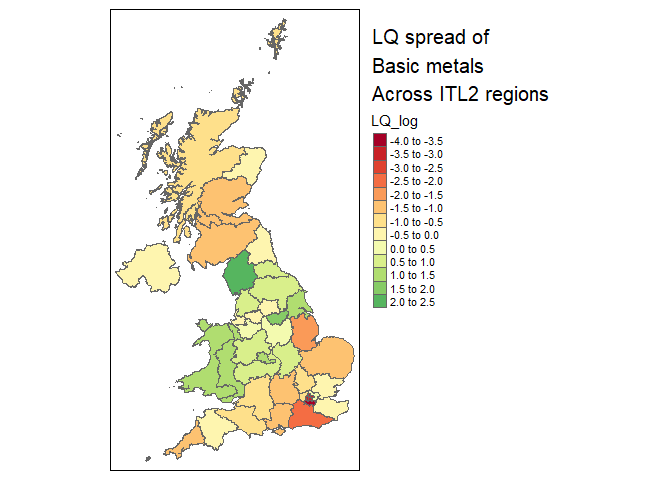

# Analysing the ONS ‘GVA by industry by ITL region’ data in R

The ONS produces an [Excel
document](https://www.ons.gov.uk/economy/grossvalueaddedgva/datasets/nominalandrealregionalgrossvalueaddedbalancedbyindustry)
with GVA data at three different geographical scales, ITL1 to ITL3.
Wikipedia has an [excellent explanation with
maps](https://en.wikipedia.org/wiki/International_Territorial_Level) of
the ITL regions.

IT2 level data includes several zones that match existing mayoral
authorities. ITL3 data has zones matching **local** authorities - but
neither perfectly. Some are grouped. For example, ITL3 zones in South
Yorkshire separate Sheffield from the other three local authorities in
South Yorkshire grouped into one zone (Rotherham, Barnsley, Doncaster).

Here, we’ll explore some ways to analyse this data using R. The data has
been processed to make it more useable in R - see the
[process_from_excel.R](process_from_excel.R) script and its comments for
an explanation of how to get from the Excel sheet to the datasets used
here. All of the derived files (and the original ONS excel sheet
downloaded from the above page, current version dated 25th April 2023)
are included in this repository in the [data folder](data).

We’ll look at the **current prices** data, not the chained volume data.
We’ll be making **location quotients**, which require being able to sum
different regions in different ways; chained volume measures can’t be
summed. Current price data (prices at the time point of the data) can’t
be used to measure nominal growth as it’s not inflation adjusted, but as
long as we’re working with proportional change over time (which as we’ll
see, LQs are), they’re fine.

## Loading in data and finding location quotients

First, load the libraries we’ll be using, and get the ITL2 level data.
(If you haven’t already, install the libraries/packages with
e.g. `install.packages("tidyverse")` before loading here.) Also, load
some functions that include an LQ function.

``` r
library(tidyverse)
library(sf)
library(tmap)
source('functions/misc_functions.R')

itl2.cp <- read_csv('data/ITL2currentprices_long.csv')
```

In this dataframe, we have: ITL2 regions, SIC sectors and year - ranging
from 1998 to 2021 in the current data - and finally the current price
GVA value.

Then we’ll find the **location quotients** for the whole dataset. The
[Excel sheet
here](https://www.ons.gov.uk/employmentandlabourmarket/peopleinwork/employmentandemployeetypes/datasets/locationquotientdataandindustrialspecialisationforlocalauthorities)
from the ONS has an excellent explanation of location quotients in its
notes, I won’t repeat all of that here. But a quick word on what the
location quotient is showing for this data:

- The location quotient gives a **measure of concentration** for sectors
  (both within regions and across them, see below) when compared to a
  larger geography (the UK in this case).
- The LQ is found easily: it’s the ratio of two ratios - the proportion
  of a sector in region x, over the proportion of that sector in the UK
  as a whole.
- If the LQ \> 1, that industry is *relatively more concentrated* in the
  region, compared to the UK.
- If the LQ \< 1, that industry is *relatively less concentrated* in the
  region, compared to the UK.
- We’re looking at raw GVA values here - the total GVA value of a
  particular sector in a region tells us something about that region’s
  economic structure. But it can’t directly be used to say anything
  definitive about productivity, since we don’t know e.g. if that GVA
  value is due to high productivity workers, or just a very large but
  lower productivity sector.
- LQs are good for getting a structural overview, but their biggest
  weakness is that a regional sector can be *proportionally larger* than
  the UK, but itself quite small. So a region’s top LQ sector may still
  be a tiny part of its overall economy. We’ll look at a way to overcome
  that weakness below.
- As the [ONS Excel sheet on
  LQs](https://www.ons.gov.uk/employmentandlabourmarket/peopleinwork/employmentandemployeetypes/datasets/locationquotientdataandindustrialspecialisationforlocalauthorities)
  make really clear, because (A/B)/(C/D) is equivalent to (A/C)/(B/D),
  the LQ actually captures two related ways of seeing the same thing:
  how relatively concentrated sectors are *across a whole geography*
  like the UK, and how concentrated *within a subgeography* like South
  Yorkshire they are. (See the table in the ONS document - numbers which
  can be read either across geographies or across sectors.)

The LQ function takes in a dataframe, the name of the region column, the
name of the sector column and the name of the value column to find the
LQ for. It returns the same dataframe with the LQ and region and total
proportions added (we’ll need those proportions later), as well the LQ
logged, which will help with plotting (as the log makes plus/minus 1
values symmetric).

First, here’s the function working on a single year in the data, to
illustrate what the function takes in.

``` r
lq1998 <- add_location_quotient_and_proportions(
  df = itl2.cp %>% filter(year == 1998),
  regionvar = ITL_region_name,
  lq_var = SIC07_description,
  valuevar = value
)
```

Let’s repeat that for all years and replace the original dataframe with
the result.

``` r
itl2.cp <- itl2.cp %>% 
  split(.$year) %>% 
  map(add_location_quotient_and_proportions, 
      regionvar = ITL_region_name,
      lq_var = SIC07_description,
      valuevar = value) %>% 
  bind_rows()
```

Taking a quick look at the resulting LQs, this is **top ten LQ sectors
for South Yorkshire**, showing which sectors have relatively larger
proportions of GVA in South Yorkshire compared to the UK as a whole.

Note we can see the point made above about *relative* LQ concentration
not capturing actual scale. ‘Manufacture of basic metals’ has 5 times
the GVA concentration of the UK as a whole, but its regional percent of
GVA is only 1.28%. This is reflecting that this sector is generally
small everywhere, just larger in South Yorkshire. Contrast with
‘Education’ - still a higher relative proportion than the UK with an LQ
of 1.7, but it’s actually nearly 11% of South Yorkshire’s GVA.

``` r
itl2.cp %>% filter(
  ITL_region_name == 'South Yorkshire',
  year == 2021
  ) %>% 
  mutate(regional_percent = sector_regional_proportion *100) %>% 
  select(SIC07_description,regional_percent, LQ) %>% 
  arrange(-LQ) %>% 
  slice(1:10)
```

    # A tibble: 10 × 3
       SIC07_description                                  regional_percent    LQ
       <chr>                                                         <dbl> <dbl>
     1 Manufacture of basic metals                                   1.28   5.14
     2 Manufacture of furniture                                      0.780  3.17
     3 Manufacture of fabricated metal products                      2.21   2.79
     4 Other manufacturing                                           0.694  2.53
     5 Manufacture of other non-metallic mineral products            0.835  2.39
     6 Manufacture of rubber and plastic products                    1.02   2.39
     7 Manufacture of electrical equipment                           0.576  1.95
     8 Motor trades                                                  2.52   1.80
     9 Education                                                    10.8    1.70
    10 Telecommunications                                            2.69   1.64

Repeating that for Greater Manchester, where none of the LQ top ten are
especially large percentages of its GVA:

``` r
itl2.cp %>% filter(
  ITL_region_name == 'Greater Manchester',
  year == 2021
  ) %>% 
  mutate(regional_percent = sector_regional_proportion *100) %>% 
  select(SIC07_description,regional_percent, LQ) %>% 
  arrange(-LQ) %>% 
  slice(1:10)
```

    # A tibble: 10 × 3
       SIC07_description                                     regional_percent    LQ
       <chr>                                                            <dbl> <dbl>
     1 Manufacture of textiles                                          0.732  3.47
     2 Sports, amusement and recreation activities                      0.979  1.71
     3 Warehousing and transport support activities                     2.11   1.64
     4 Manufacture of rubber and plastic products                       0.687  1.61
     5 Travel agency and tour operator activities                       0.528  1.59
     6 Office administration and business support activities            1.85   1.50
     7 Manufacture of food products                                     1.62   1.47
     8 Manufacture of wood and paper products                           0.573  1.38
     9 Repair of computers, personal and household goods                0.162  1.33
    10 Telecommunications                                               2.16   1.32

Liverpool City Region has three public-sector-heavy SICs in its LQ top
ten:

``` r
itl2.cp %>% filter(
  ITL_region_name == 'Merseyside',
  year == 2021
  ) %>% 
  mutate(regional_percent = sector_regional_proportion *100) %>% 
  select(SIC07_description,regional_percent, LQ) %>% 
  arrange(-LQ) %>% 
  slice(1:10)
```

    # A tibble: 10 × 3
       SIC07_description                                      regional_percent    LQ
       <chr>                                                             <dbl> <dbl>
     1 Manufacture of motor vehicles                                     1.96   2.89
     2 Manufacture of petroleum, chemicals and pharmaceutica…            4.20   2.50
     3 Manufacture of other non-metallic mineral products                0.770  2.20
     4 Human health activities                                          12.0    1.91
     5 Gambling and betting activities                                   0.467  1.86
     6 Sports, amusement and recreation activities                       1.04   1.81
     7 Security and investigation activities                             0.323  1.49
     8 Public administration and defence                                 7.19   1.39
     9 Warehousing and transport support activities                      1.72   1.34
    10 Land transport                                                    1.40   1.32

As mentioned, the LQ has a handy bonus feature: it can be used either to
compare sectors *within* subregions, as above, or - looking at
individual sectors - to see how geographical concentration differs.

Sectors with the highest difference across places in the uK will have a
higher spread between their min and max LQ values. Some sectors - often
public sectors - are fairly evenly spread everywhere. Here we find the
spread and pick out the top five most geographically varied:

``` r
#Find the geographical variation of sectors using the LQ spread
LQspread <- itl2.cp %>% 
  filter(year == 2021) %>% 
  group_by(SIC07_description) %>% 
  summarise(LQ_spread = diff(range(LQ))) %>% 
  arrange(-LQ_spread)

#Show top 5
LQspread[1:5,]
```

    # A tibble: 5 × 2
      SIC07_description                             LQ_spread
      <chr>                                             <dbl>
    1 Forestry and fishing                              41.5 
    2 Mining and quarrying                              35.4 
    3 Manufacture of beverages and tobacco products     15.4 
    4 Manufacture of basic metals                       10.8 
    5 Manufacture of other transport equipment           9.77

That can then be used to pick out particular sectors to map. For
example, South Yorshire’s most concentrated GVA sector - manufacture of
basic metals - looks like this across the UK (note South Yorkshire
doesn’t top the most concentrated for this sector).

The map shapefiles are included in this repo, and can also be downloaded
from
[geoportal.statistics.gov.uk](https://geoportal.statistics.gov.uk/).

``` r
#Load ITL2 map data using the sf library
itl2.geo <- st_read('data/ITL_geographies/International_Territorial_Level_2_January_2021_UK_BFE_V2_2022_-4735199360818908762/ITL2_JAN_2021_UK_BFE_V2.shp') %>% 
  st_simplify(preserveTopology = T, dTolerance = 100)
```

    Reading layer `ITL2_JAN_2021_UK_BFE_V2' from data source 
      `D:\Dropbox\YPERN\R\regionalGVAbyindustry\data\ITL_geographies\International_Territorial_Level_2_January_2021_UK_BFE_V2_2022_-4735199360818908762\ITL2_JAN_2021_UK_BFE_V2.shp' 
      using driver `ESRI Shapefile'
    Simple feature collection with 41 features and 6 fields
    Geometry type: MULTIPOLYGON
    Dimension:     XY
    Bounding box:  xmin: -70.2116 ymin: 5333.602 xmax: 655989 ymax: 1220302
    Projected CRS: OSGB36 / British National Grid

``` r
#Join map data to a subset of the GVA data
sector_LQ_map <- itl2.geo %>% 
  right_join(
    itl2.cp %>% filter(
      year==2021,
      SIC07_description == LQspread$SIC07_description[4]#picking out the fourth highest geographical spread sector
      ),
    by = c('ITL221NM'='ITL_region_name')
  )

#Plot map
tm_shape(sector_LQ_map) +
  tm_polygons('LQ_log', n = 9) +
  tm_layout(title = 'LQ spread of\nBasic metals\nAcross ITL2 regions', legend.outside = T)
```

<!-- -->

## LQ change and growth over time

Now onto plotting LQs. To do this, we’ll add in a measure of what the
change/growth trends for LQs are. This next function adds in some
ordinary least squares slopes for LQ change over time, to get a sense of
the growth trends in LQ for each region’s SIC sectors. LQ_log is used so
that slope scale is the same for different size sectors, so their trends
are comparable. (It returns zero for any region/sector combinations with
no data at all.)

``` r
#Use
#LQ_slopes %>% filter(slope==0)
#To see which didn't get slopes (only 8 rows in the current data)

LQ_slopes <- compute_slope_or_zero(
  data = itl2.cp, 
  ITL_region_name, SIC07_description, 
  y = LQ_log, x = year)
```
